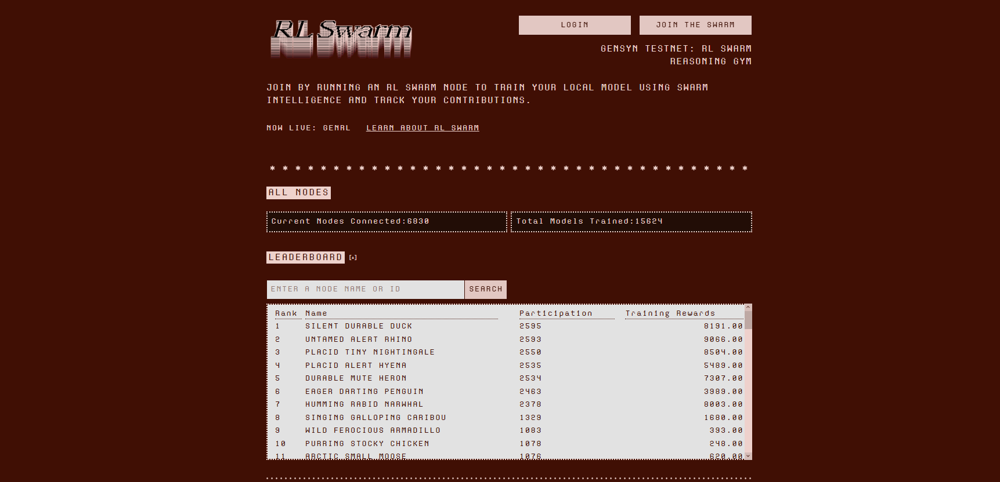
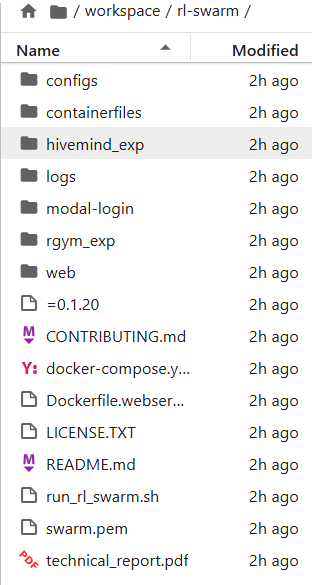
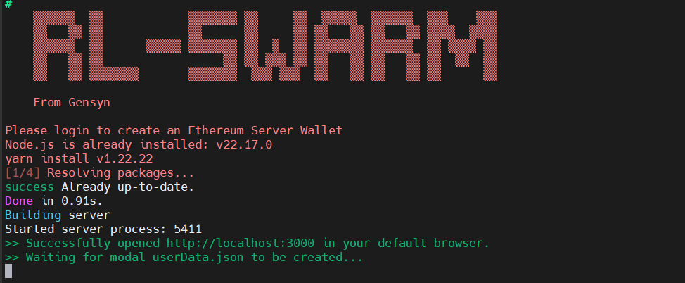
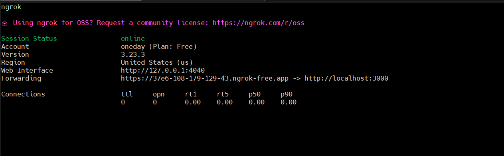
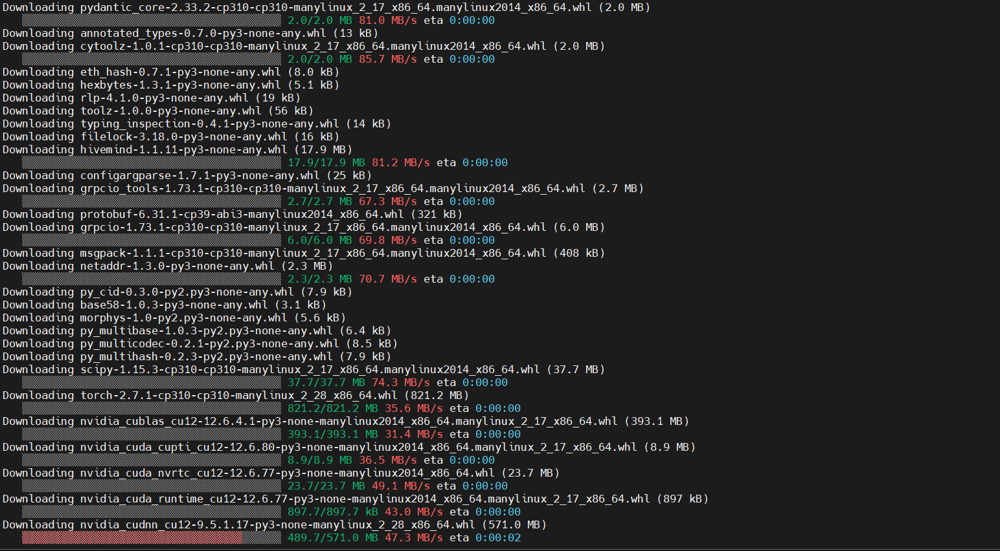
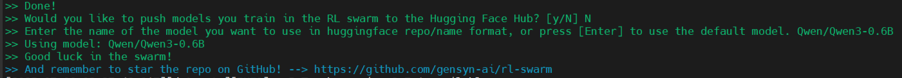
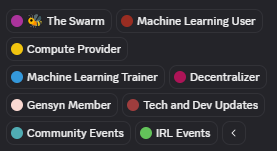

# Gensyn RL-Swarm Node Setup Guide

This guide explains how to run a [Gensyn RL-Swarm](https://github.com/gensyn-ai/rl-swarm)



## REQUIREMENTS :
1. Quickpod : For rent GPU [Quickpod](https://console.quickpod.io/)
   ### Supported Hardware : 
   - arm64 or x86 CPU with minimum 32gb ram
   - CUDA devices (officially supported):
     - RTX 3090
     - RTX 4090
     - RTX 5090
     - A100
     - H100
    #### Note :  I used an RTX 3090
2. Ngrok : For logging into your Gensyn account via web browser [Ngrok](https://dashboard.ngrok.com/)

## Step 1: Create a Pod on QuickPod

1. Log in to QuickPod → go to **Templates**
2. Search for: `cuda`
3. Select: **Jupyter Lab CUDA 12.4 or newer version**
4. Choose your desired GPU (e.g., `RTX 3090`)
5. Click **Create Pod**
6. Increase **Disk Space to 50 GB**
7. Once deployed, go to the **Pods** tab → click **Connect**
8. You can either:
   - Use the **Web Terminal**, or
   - Copy the **SSH command** and connect via MobaXterm

## Step 2: Create Ngrok Account and Save Your Authtoken

1. Log in to Ngrok → go to **Your Authtoken**
2. Save it

## Step 3: Install Required Dependencies

#### Update system & install basic tools
```bash
apt update && apt upgrade -y
apt install screen -y
```
#### Install Python & virtual environment support
```bash
apt install python3 python3-pip python3-venv python3-dev -y
```
#### Install Node.js v22
```bash
curl -fsSL https://deb.nodesource.com/setup_22.x | bash -
apt install -y nodejs
```
#### Install Yarn
```bash
curl -o- -L https://yarnpkg.com/install.sh | bash
export PATH="$HOME/.yarn/bin:$HOME/.config/yarn/global/node_modules/.bin:$PATH"
source ~/.bashrc
```
## Step 4: Install & Configure Ngrok
####  Install Ngrok
```bash
curl -sSL https://ngrok-agent.s3.amazonaws.com/ngrok.asc \
  | tee /etc/apt/trusted.gpg.d/ngrok.asc >/dev/null \
  && echo "deb https://ngrok-agent.s3.amazonaws.com buster main" \
  | tee /etc/apt/sources.list.d/ngrok.list \
  && apt update \
  && apt install ngrok
```
#### Add your Ngrok Authtoken
```bash
ngrok config add-authtoken YOUR-TOKEN
```
## Step 5: Clone & Prepare RL-Swarm
```bash
git clone https://github.com/gensyn-ai/rl-swarm/
```
#### Recover swarm.pem (if you have ever run node): 


1. Open Jupyter Lab (QuickPod > Connect > Jupyter Lab)
2. Navigate to /workspace/rl-swarm/
3. Drag & drop your swarm.pem file from your local machine into that folder

#### If you are just running node, then go to step 6 and in the last step you will be told how to backup swarm.pem

## Step 6: Run the Node
#### Start a new screen session
```bash
screen -S swarm
```
```bash
cd rl-swarm
```
#### Launch the node
```bash
python3 -m venv .venv
```
```bash
. .venv/bin/activate

## if an error appears, use this :
source .venv/bin/activate
```
```bash
./run_rl_swarm.sh
```

#### If successful then you will see "Waiting for modal userData.json to be created..."


You can minimize screen : `ctrl` `A`+`D`

## Step 7: Login via Ngrok in Browser
```bash
ngrok http 3000
```
#### Copy the Ngrok forwarding link


Example output:
```bash
Forwarding https://abc123.ngrok.io -> http://localhost:3000
```
Open the HTTPS link in your local browser. Then:
1. Enter your email
2. Click Log in
3. Check your email for the OTP code
4. You're now logged in

#### Return to your running node screen
```bash
screen -r swarm
```
Wait for installation



#### Answer prompt :


Would you like to push models you train in the RL swarm to the Hugging Face Hub? [y/N] >>> Type N

Enter the name of the model you want to use in huggingface repo/name format, or press [Enter] to use the default model. >>> press Enter to use the default or you can choose one of the following models:
- Gensyn/Qwen2.5-0.5B-Instruct
- Qwen/Qwen3-0.6B
- nvidia/AceInstruct-1.5B
- dnotitia/Smoothie-Qwen3-1.7B
- Gensyn/Qwen2.5-1.5B-Instruct

# Check Node Status
Visit : https://dashboard.gensyn.ai/ login with your email.

# Backup swarm.pem (if you are new to running node): 


1. Open Jupyter Lab
2. Go to /workspace/rl-swarm/
3. Right-click on swarm.pem → Download

# How to Update Your RL-Swarm Node
If you've previously set up your node and want to update it to the latest version, follow these steps:

1. Reconnect to your screen session
```bash
screen -r swarm
```

2. Stop the running node
`Ctrl` + `C`

This will stop the currently running RL-Swarm process.

3. Go to the rl-swarm directory
```bash
cd rl-swarm
```

4. Pull the latest changes from GitHub
```bash
git pull
```
This will update your local copy of the RL-Swarm repository to the latest version available on GitHub.

5. Relaunch the node

Follow step 6 in the previous tutorial to run the node.

# How to Setup GSwarm and Get SWARM Role on Discord



[GSwarm Setup & SWARM Role Access Guide](https://github.com/ara-dsi/gensyn-node-setup/blob/main/README2.md#gswarm-setup--swarm-role-access-guide)
