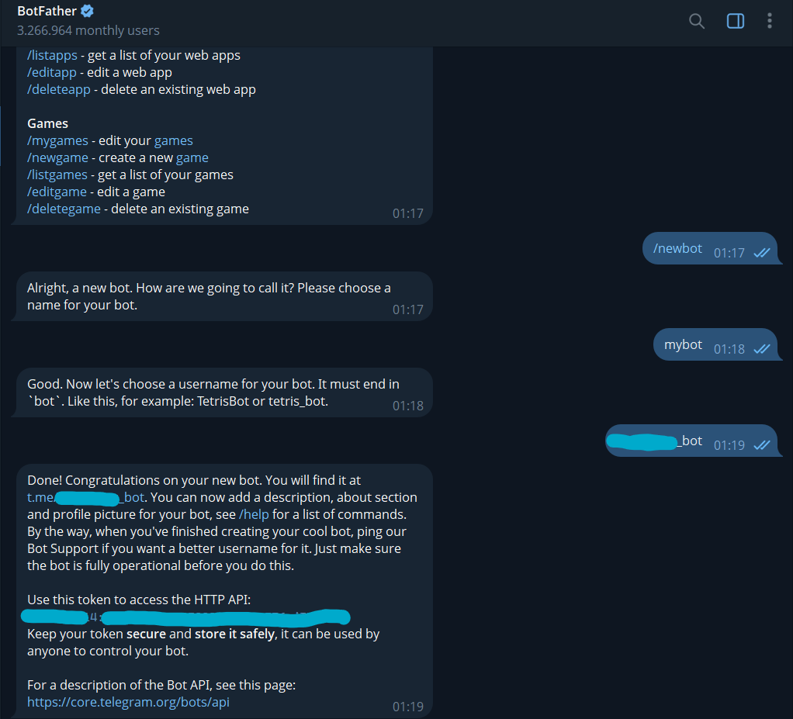
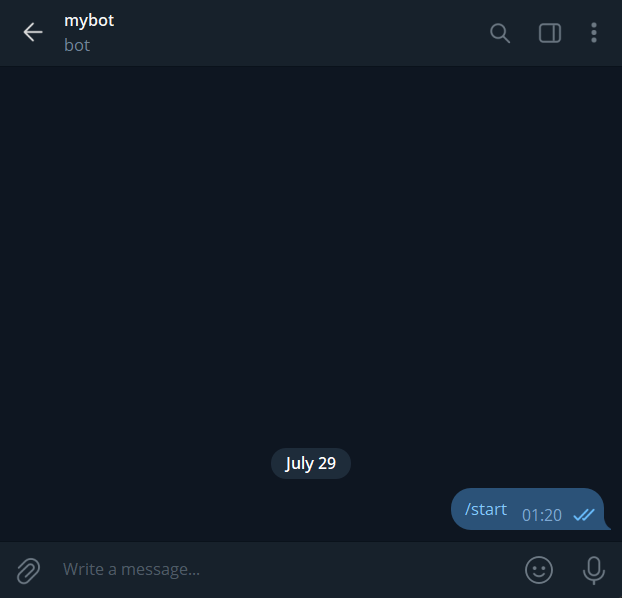
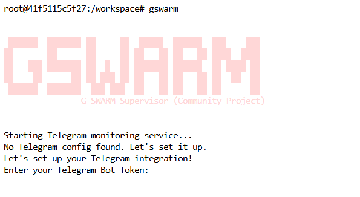

# GSwarm Setup & SWARM Role Access Guide

This guide will help you install GSwarm, link your Telegram and Discord accounts, and claim your SWARM role to access the private channel for active participants.

## Install Go

#### Download Go 
```bash
wget https://go.dev/dl/go1.22.3.linux-amd64.tar.gz
```
#### Extract and install to /usr/local
```bash
tar -C /usr/local -xzf go1.22.3.linux-amd64.tar.gz
```
#### Add Go to PATH
```bash
echo 'export PATH=$PATH:/usr/local/go/bin' >> ~/.bashrc
source ~/.bashrc
```
#### Verify installation
```bash
go version
```
## Install GSwarm
#### Install GSwarm using Go
```bash
go install github.com/Deep-Commit/gswarm/cmd/gswarm@latest
```
#### Check version
```bash
gswarm --version
```

## Telegram Bot Setup (Step-by-Step)

1. Create a Telegram Bot:



- Chat with @BotFather on Telegram
- Send /newbot and follow the instructions
- Save the bot token provided

Example :
 ```bash
    1234567890:ABCdefGHIjklMNOpqrsTUVwxyz
 ```

2. Get Your Chat ID:



- Send any message to your newly created bot
- Open this URL in your browser (replace with your bot token):
 ```bash
    https://api.telegram.org/botYOUR_BOT_TOKEN/getUpdates
 ```    
Example :
 ```bash
    https://api.telegram.org/bot1234567890:ABCdefGHIjklMNOpqrsTUVwxyz/getUpdates
 ```
Example response:
 ```bash
{
  "ok": true,
  "result": [
    {
      "message": {
        "message_id": 2021,
        "from": {
          "id": 123456789,
          "is_bot": false,
          "first_name": "GSwarm",
          "username": "gswarm_user",
          "language_code": "en"
        },
        "chat": {
          "id": 123456789,
          "first_name": "GSwarm",
          "username": "gswarm_user",
          "type": "private"
        },
        "date": 1704067200,
        "text": "Hello bot!"
      }
    }
  ]
}
 ```  
Your Chat ID is `123456789` in the example above.

Tip: If you get an empty response like {"ok":true,"result":[]}, try sending a message to your bot first and reload the URL.

## Configure GSwarm


Run:
 ```bash
    gswarm
 ```
Follow the prompts to input:
1. Telegram Bot Token: from @BotFather
2. Telegram Chat ID: your personal or group chat ID
3. EOA Address: your Ethereum wallet address from the Gensyn dashboard

## Link Discord and Telegram

1. In Discord (on the #swarm-link channel), type:
 ```bash
    /link-telegram
 ```
 Copy the code it gives you (e.g., ABCD1234)

2. In Telegram, type:
 ```bash
    /verify ABCD1234
 ```

Your accounts will now be linked.


